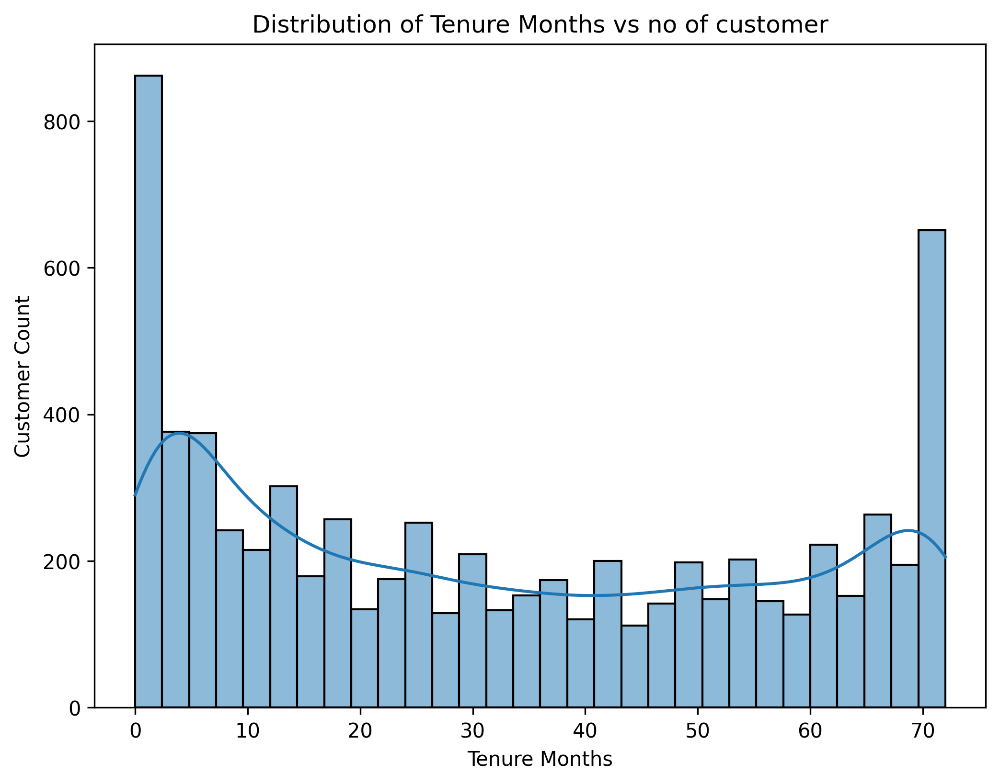
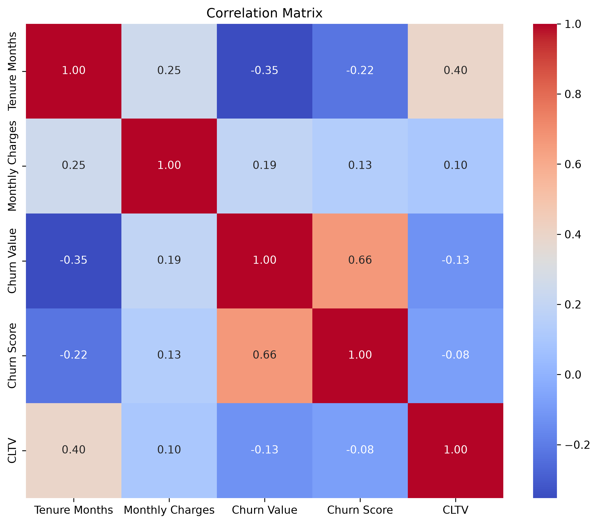
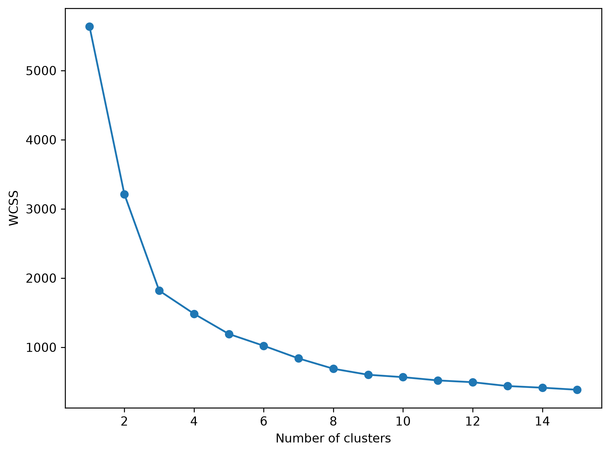
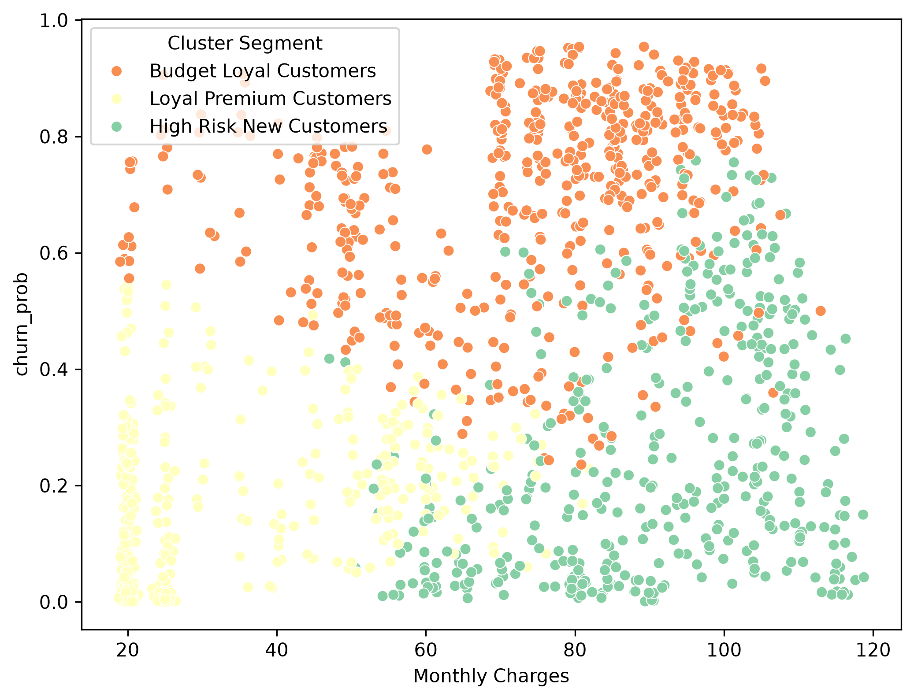
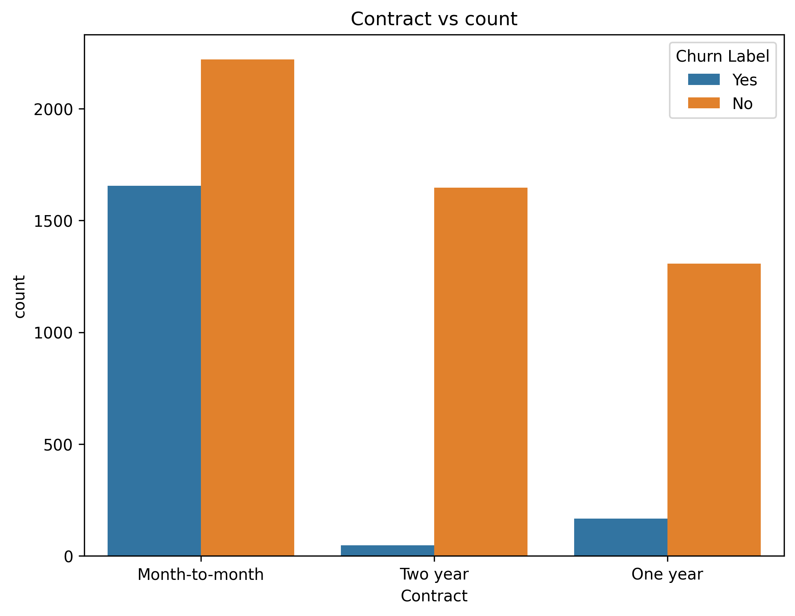

# 📊 Customer Churn Prediction & Customer Segmentation using Machine Learning


## 📌 Project Overview

Customer churn is one of the biggest challenges faced by subscription-based businesses. Retaining existing customers is significantly more cost-effective than acquiring new ones. This project focuses on predicting customers who are likely to churn using Machine Learning and grouping customers into meaningful segments using K-Means Clustering.

The project follows a complete Machine Learning workflow—from data preprocessing and exploratory data analysis to model building, evaluation, and business insight generation. The objective is to help telecom companies identify high-risk customers and make data-driven retention decisions.

## 🚀 Project Highlights

- Built an end-to-end Machine Learning pipeline for customer churn prediction.
- Achieved **79.35% model accuracy** using a Random Forest Classifier.
- Improved model performance through **class imbalance handling** and **hyperparameter tuning**.
- Performed **customer segmentation** using K-Means Clustering.
- Generated business insights to support customer retention strategies.

---

## 🎯 Business Problem

Telecom companies experience customer loss due to various factors such as contract type, monthly charges, tenure, payment methods, and customer support services.

The objectives of this project are:

* Predict whether a customer is likely to churn.
* Identify the most important factors contributing to churn.
* Segment customers based on their behavior.
* Generate actionable business insights for customer retention.

---

## 📂 Dataset Information

This dataset was downloaded from Kaggle and is included in this repository as `Telco_customer_churn.xlsx`.

| Property | Value |
| --- | --- |
| Dataset | Telco Customer Churn Dataset |
| Source | [IBM Telco Customer Churn Dataset from Kaggle](https://www.kaggle.com/datasets/yeanzc/telco-customer-churn-ibm-dataset) |
| Rows | 7,043 customers |
| Columns | 33 features |
| Target | `Churn Value` (1 = churned, 0 = stayed) |
| Class Balance | ~26% churned, ~74% stayed |

---

## ✨ Key Features

* Data Cleaning and Preprocessing
* Exploratory Data Analysis (EDA)
* Feature Engineering
* Categorical Feature Encoding
* Train-Test Split
* Random Forest Classification
* Handling Class Imbalance
* Hyperparameter Tuning
* Feature Importance Analysis
* ROC Curve & AUC Evaluation
* Customer Segmentation using K-Means Clustering
* Business Insight Generation

---

## 🛠 Technologies Used

* Python
* Pandas
* NumPy
* Matplotlib
* Seaborn
* Scikit-Learn
* Random Forest Classifier
* K-Means Clustering
* Jupyter Notebook

---

## ⚙ Project Workflow

1. Data Collection
2. Data Cleaning
3. Exploratory Data Analysis (EDA)
4. Feature Engineering
5. Data Preprocessing
6. Random Forest Classification
7. Handling Class Imbalance
8. Hyperparameter Tuning
9. Feature Importance Analysis
10. ROC Curve & AUC Analysis
11. Customer Segmentation using K-Means
12. Business Insight Generation

---

## 📊 Model Performance

| Metric    | Score      |
| --------- | ---------- |
| Accuracy  | **79.35%** |
| Precision | **66%**    |
| Recall    | **51%**    |
| F1-Score  | **58%**    |

## 📈 Model Comparison

| Model | Accuracy |
|--------|----------|
| Random Forest | 79.13% |
| Random Forest (Balanced) | **79.35%** ✅ |

---

## 📈 Exploratory Data Analysis

During the EDA phase, various visualizations were created to better understand customer behavior and identify factors influencing churn.

The analysis included:

* Customer Churn Distribution
* Tenure Distribution
* Monthly Charges Distribution
* Contract Type Analysis
* Payment Method Analysis
* Tech Support Analysis
* Correlation Heatmap
* Feature Importance Visualization

---

## 👥 Customer Segmentation

Customers were segmented using **K-Means Clustering** based on:

* Tenure Months
* Monthly Charges
* Total Charges
* Predicted Churn Probability

The segmentation helps identify different customer groups for targeted retention strategies and personalized business decisions.

---

## 📷 Project Visualizations

### Customer Churn Distribution



### Correlation Heatmap



### Feature Importance


### ROC Curve


### Elbow Method



### Customer Segmentation



### Contract vs Churn



---

## 💡 Business Insights

The project revealed several important insights:

* Customers with shorter tenure are more likely to churn.
* Month-to-month contracts show significantly higher churn rates.
* Customers without Tech Support have a higher probability of leaving the service.
* Higher monthly charges are associated with increased churn risk.
* Customer segmentation helps distinguish high-risk customers from loyal long-term customers, enabling more effective retention campaigns.

---

## 🎓 Skills Demonstrated

* Data Cleaning & Preprocessing
* Exploratory Data Analysis (EDA)
* Data Visualization
* Feature Engineering
* Machine Learning
* Model Evaluation
* Hyperparameter Tuning
* Customer Segmentation
* Business Analytics
* Git & GitHub

---

## 📚 What I Learned

This project provided hands-on experience with the complete Machine Learning lifecycle.

Through this project, I learned how to:

* Understand and analyze real-world business problems.
* Clean and preprocess raw datasets for machine learning.
* Perform Exploratory Data Analysis (EDA) to uncover meaningful patterns.
* Build, train, and evaluate classification models using Random Forest.
* Handle imbalanced datasets using class weighting techniques.
* Improve model performance through hyperparameter tuning.
* Interpret model predictions using feature importance analysis.
* Evaluate models using Accuracy, Precision, Recall, F1-Score, ROC Curve, and AUC Score.
* Apply K-Means Clustering for customer segmentation.
* Convert analytical findings into actionable business insights.
* Document and organize a complete Data Science project using GitHub.

---

## 📁 Project Structure

```
Customer-Churn-Prediction/
│
├── Customer_Churn_Prediction.ipynb
├── README.md
├── requirements.txt
├── Telco_customer_churn.xlsx
└── images/
    ├── churn_distribution.png
    ├── contract_vs_churn.png
    ├── correlation_matrix.png
    ├── customer_segmentation_monthly_charges.png
    ├── customer_segmentation_tenure.png
    ├── customer_segmentation_total_charges.png
    ├── elbow_method.png
    ├── monthly_charges_distribution.png
    ├── payment_method_vs_churn.png
    ├── tech_support_vs_churn.png
    └── tenure_distribution.png
```

---

## ▶️ How to Run

1. Clone this repository.
2. Install the required dependencies:

```
pip install -r requirements.txt
```

3. Open the notebook:

```
Customer_Churn_Prediction.ipynb
```

4. Run all notebook cells sequentially.

---

## 🚀 Future Improvements

* Compare Random Forest with XGBoost and LightGBM.
* Apply advanced feature engineering techniques.
* Deploy the trained model using Flask or Streamlit.
* Build an interactive dashboard for customer churn monitoring.
* Automate predictions using a REST API.

---

## 🙏 Acknowledgement

This project was completed as part of the **Summer Internship Program 2026** at **Coding Blocks School of Technology (CBSOT)**. I would like to thank my mentor and the CBSOT team for their guidance throughout the project.

---

## 👤 Author

**Siddhant Shinde**

Computer Science Engineering Student

Aspiring Data Scientist | Machine Learning Enthusiast

📧 Email: shindesiddhant415@gmail.com

💼 LinkedIn: https://www.linkedin.com/in/siddhant-shinde-36b621377/


---

## 📜 License

This project is released for educational and learning purposes. Feel free to explore, learn from, and build upon it with appropriate attribution.
